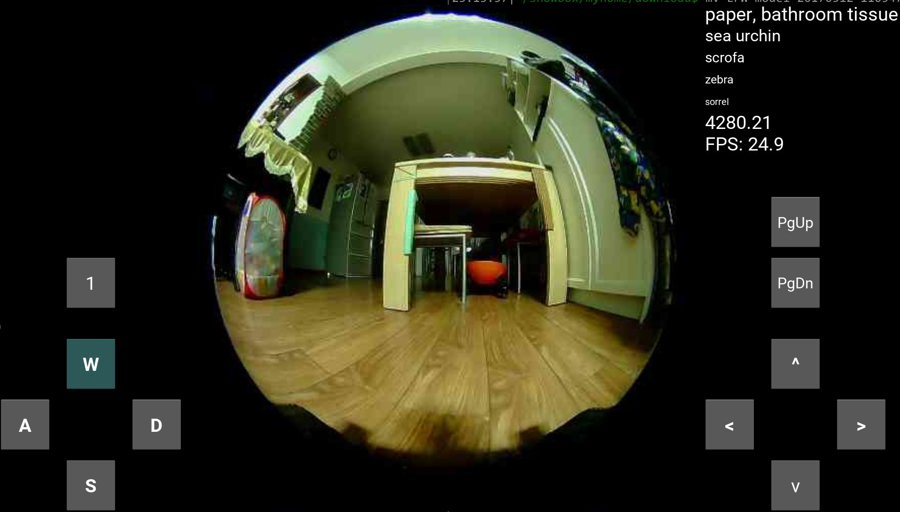
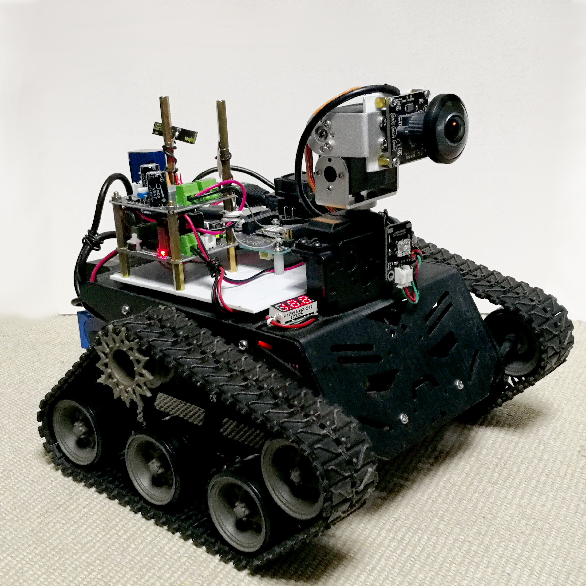
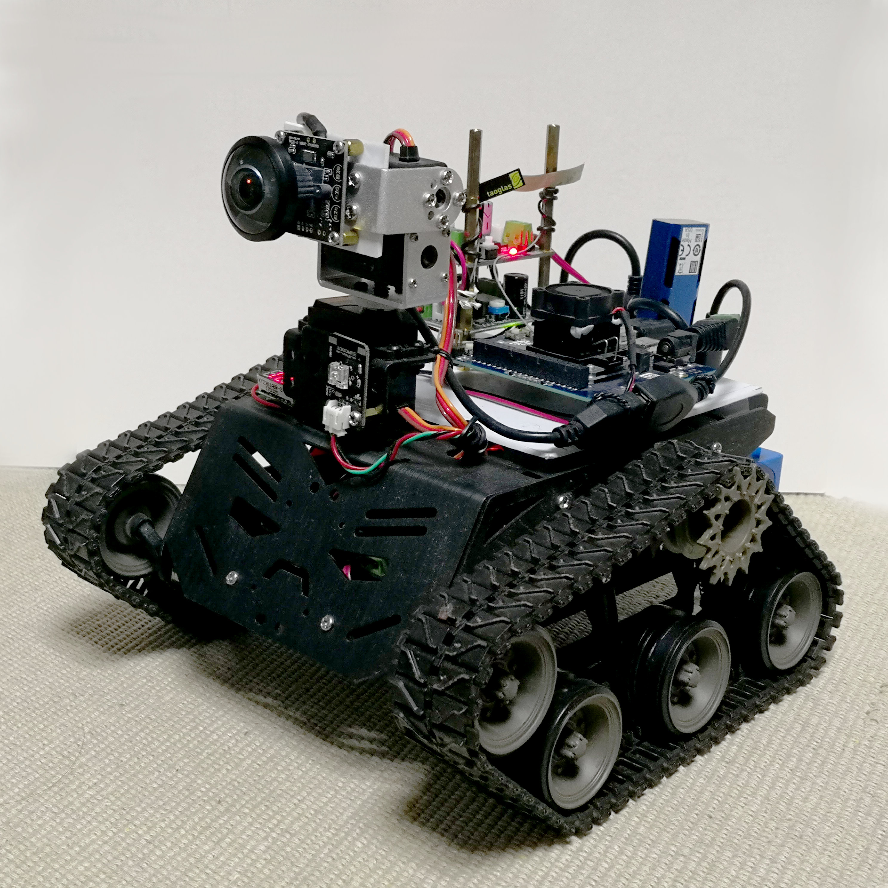
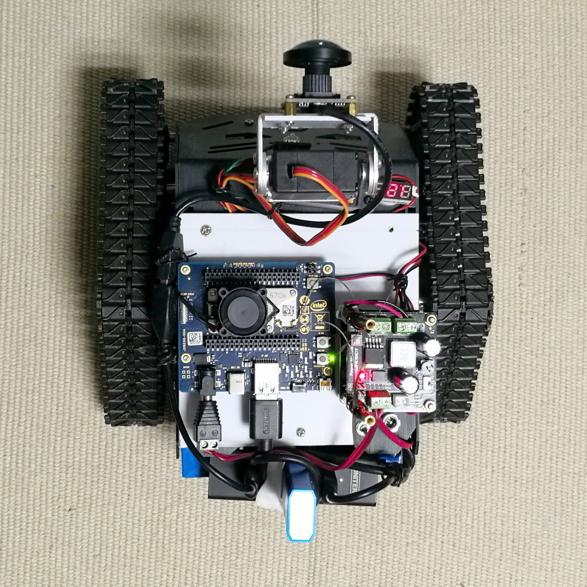

# RobotControl
Total solution for a DFRobot Devastator Tank mobile robot

## Intro
This is a hobbist project I made for a robot tank.

## Software
The software stack of RobotControl has the following features:
* Seperate bottom half and upper half, decouple mechanic control and logic+camera.
* Support visual AI inference on the Robot (through an Neural Computing Stick).
* Support telebotics through TCP/IP network, allow remote control as well as telemetric through built-in camera on the robot.
* Kivy based client allow easy porting to multiple platform including Linux, Windows, Mac, Android.

The UI of telebotic looks like:

## Hardware
The project also comes with a reference hardware design, the hardware has the following features:
* Built with a single 180 degree fisheye camera.
* Dual servo driven camera allows better fovea vision.
* Bottom half is made from a DFRobot:registered: Devastator Tank mobile robot platform, driven by a Romeo Arduino:registered: board.
* Upper half is made from a Intel:registered: Joule 570x board.  Other x86 based board should also work.
* Upper half equipped with an AI stick -- Intel:registered: Movidius Neural Computing Stick, provides low power real time AI inference.

Here is how the Robot tank cart looks like:

Front right view

Front left view

Top view

